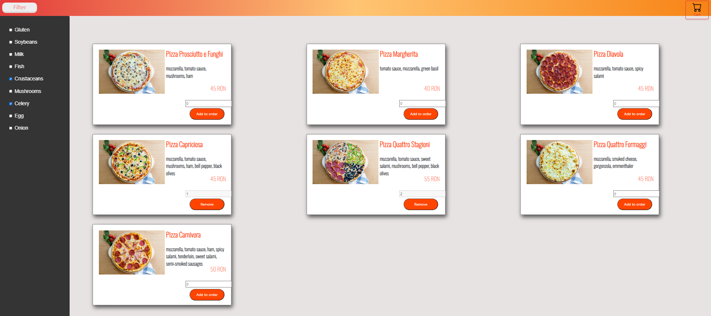
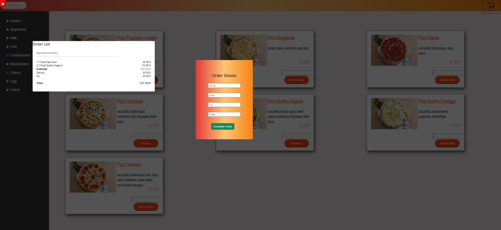

# Pizza Kawaii Website

Welcome to the Pizza Kawaii Website! This is an online platform for ordering pizza. The site was developed as a study team project at Codecool. 

## Code Contributors

- [Teodor-Mihai Marinaș](https://github.com/teodor-marinas)
- [Andra Căpraru](https://github.com/Andra0011)
- [Bianca Dascălu](https://github.com/Bianca296)

## Install Dependencies

The project uses Bootstrap, Express, and Nodemon. To install these dependencies, navigate to the server directory and run the npm install command.

```bash
cd ./server
npm install
```

## Running the Code

To run the code, navigate to the server directory and run the node server.js command.

```bash
cd ./server
node server.js
```

## Screenshots



